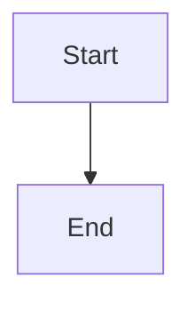

<%*
const topicSegment = tp.file.folder(true).split("/")[0].replace(/^\d+-/, "");
-%>
---
tags: [example]
created: <% tp.date.now("YYYY-MM-DD") %>
---

# Example: <% tp.file.title %>

## Goal

What this example demonstrates, and which chapter concept it belongs to (link back to the
chapter's main note, e.g. `[[SomeConcept]]`).

## Walkthrough

```

```

## Step by step

1.

## Diagram



## See also

-

## References

- [[<% topicSegment %>-Bibliography|Bibliography]]
