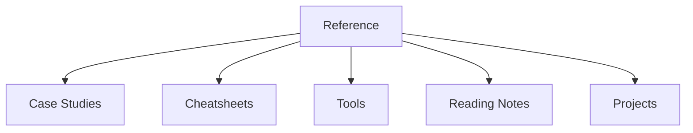

<%*
const topicName = await tp.system.prompt("Topic name — a short PascalCase identifier, e.g. Rust, ReverseEngineering", "", true);
await tp.file.move(topicName + "/" + topicName);
-%>
---
tags: [moc, topic]
aliases: []
created: <% tp.date.now("YYYY-MM-DD") %>
---

# <% tp.file.title %>

One-paragraph description of this topic: what it covers and why you're studying it.

## Map of this topic

| Section | Covers |
|---|---|
| [[<% topicName %>-Reference\|Reference]] | glossary, bibliography, vault-wide reference-entry/example/snippet listings for this topic |
| [[<% topicName %>-Case-Studies\|Case Studies]] | full real-project investigations |
| [[<% topicName %>-Cheatsheets\|Cheatsheets]] | standalone quick-reference pages |
| [[<% topicName %>-Tools\|Tools]] | notes on the tools you actually use |
| [[<% topicName %>-Reading-Notes\|Reading Notes]] | books, courses, papers, RFCs |
| [[<% topicName %>-Projects\|Projects]] | personal coding projects |

## Chapters

_(populate as you add chapters with [[New-Chapter]])_

-

## See also

- [[Home]]

> [!todo] Finish setting up this topic (see `CLAUDE.md` → "Adding a new topic")
> This template just created `<% topicName %>/<% tp.file.title %>.md` for you. Still to do
> by hand:
> - [ ] Copy `01-Reference/`, `Case-Studies/TOPIC-Case-Studies.md` (skip `demo-project-case-study/`
>   — that one stays in `_Topic-Skeleton/` as reference-only documentation), `Cheatsheets/`,
>   `Tools/`, `Reading-Notes/`, and `Projects/` from `_Topic-Skeleton/` into
>   `<% topicName %>/`
> - [ ] Rename every `TOPIC`-prefixed file you copied, e.g. `TOPIC-Reference.md` →
>   `<% topicName %>-Reference.md`
> - [ ] Find-and-replace the `TOPIC` placeholder inside those files' content (titles, aliases,
>   Dataview `FROM` clauses, wikilinks)
> - [ ] Add this topic's `folder_templates` entries to
>   `.obsidian/plugins/templater-obsidian/data.json` — copy the block from `CLAUDE.md` →
>   "Adding a new topic"
> - [ ] Add this topic to the table in `Home.md` and `README.md`
> - [ ] Delete this reminder block once everything above is done
